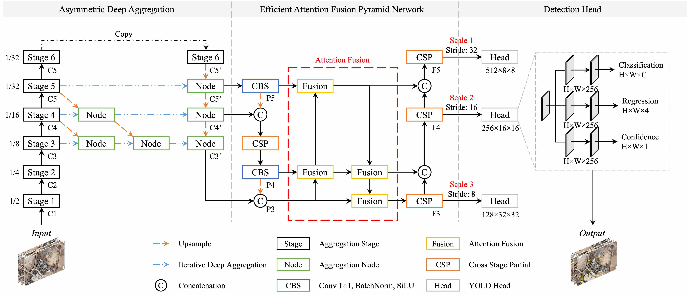
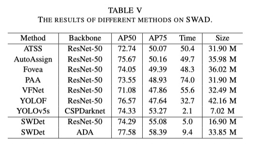

# SWDet
**PyTorch implementation of "*SWDet: Anchor-based Object Detector for Solid Waste Detection in Aerial Images*"**

## Highlights
  <p align="center"> </p>
  <p align="center"> </p>

## Benchmark
|Model          |    Backbone     |    MS  |  Rotate | Lr schd  | Inf time (fps) | box AP| Download|
|:-------------:| :-------------: | :-----:| :-----: | :-----:  | :------------: | :----: | :---------------------------------------------------------------------------------------: |
|DARDet         |    R-50-FPN     |   -     |  -     |   1x     |      12.7      |  77.61 | [cfg](configs/DARDet/dardet_r50_fpn_1x_dcn_test.py)[model](https://pan.baidu.com/s/1aspypaz8a7QvFyUdDR986g)    |
|DARDet         |    R-50-FPN     |   -     |  ✓    |   2x     |      12.7      |  78.74 |  [cfg](configs/DARDet/dardet_r50_fpn_1x_dcn_rotate_test.py)[model](https://pan.baidu.com/s/1VPsAB3Kb90IqJTluH6lFHw)     |

## Citation
```
@misc{swdet,
   author={Liming Zhou, Xiaohan Rao, Yahui Li, Xianyu Zuo, Yang Liu, Yinghao Lin, and Yong Yang},
   title={SWDet: Anchor-based Object Detector for Solid Waste Detection in Aerial Images},
   howpublished={\url{https://github.com/shenhaibb/SWDet}},
   year={2022},
}

@misc{yolov5,
   author={Ultralytics},
   title={YOLOv5},
   howpublished={\url{https://github.com/ultralytics/yolov5}}
}
```

## Contact
**Any question regarding this work can be addressed to [shenhaibb@henu.edu.cn](shenhaibb@henu.edu.cn).**
